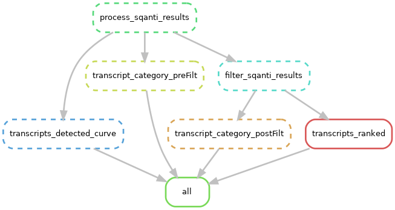
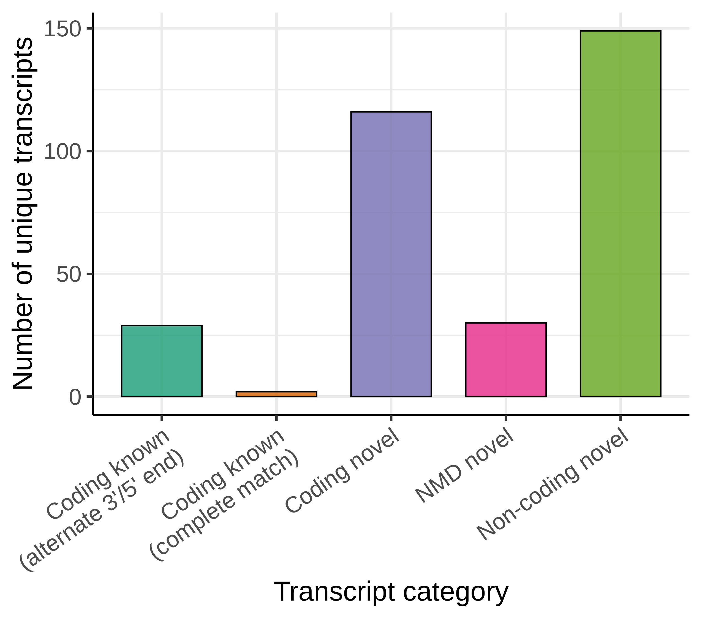
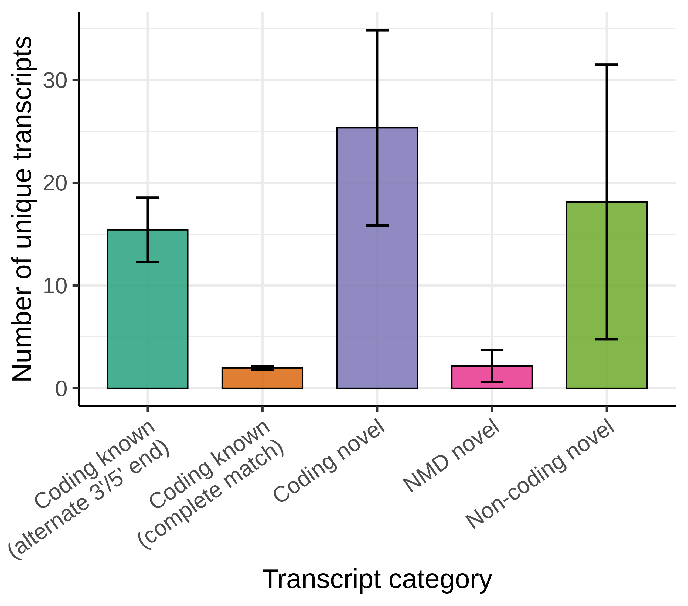
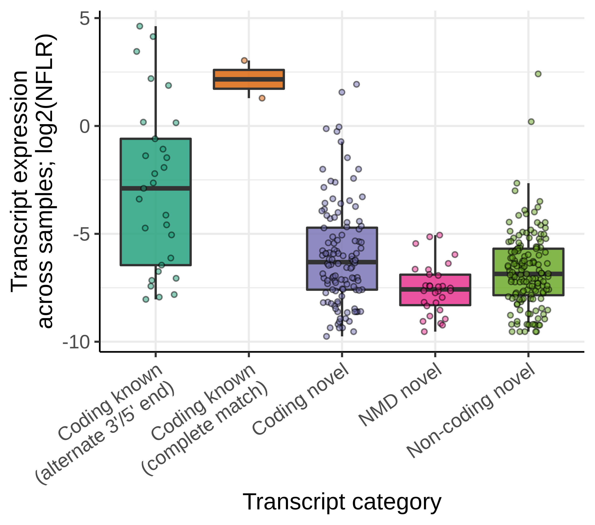
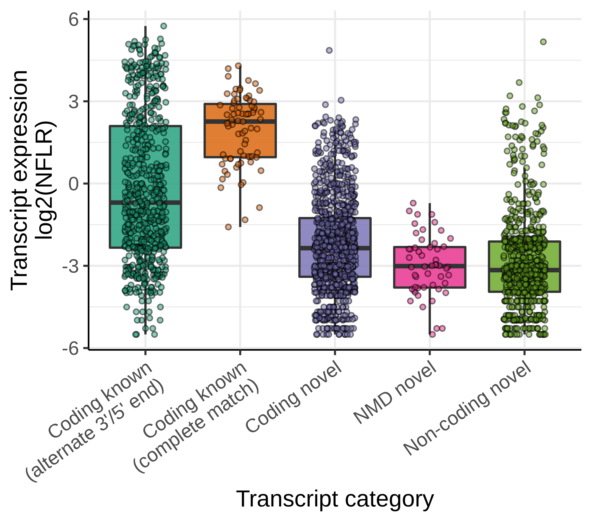

# PSQAN - Post Sqanti QC ANalysis

<!-- badges: start -->


[](https://github.com/sid-sethi/APTARS/blob/main/LICENSE)
<!-- badges: end -->

PSQAN is a `snakemake` pipeline for performing post Sqanti QC analysis on Pacbio sequencing data. PSQAN can be used to explore the transcript categories and expression associated with a gene. PSQAN filters transcripts which could be possible arteficts, normalises expression and generates multiple visualisations which can help in determining optimal expression thresholds to identify genuine transcripts (known/novel). An example of the report generated by PSQAN for a single gene can be viewed [here](test_output/psqan_report.html). Below is the dag of the pipeline:

<p align="center">
    
</p>


# Getting Started

## Input

- Sqanti _classification.txt file
- Sqanti _corrected.fasta file
- Gene of interest (Recommended, but optional)


## Output

Following transcript characterisation from SQANTI, PSQAN applies a set of filtering criteria to remove potential genomic contamination and rare PCR artifacts. PSQAN removes an isoform if: (1) the percent of genomic "A"s in the downstream 20 bp window is more than 80% (“perc_A_downstream_TTS” > 80); (2) one of the junctions is predicted to be template switching artifact (“RTS_stage” = TRUE); or (3) it is not associated with the gene of interest. Using SQANTI’s output of ORF prediction, NMD prediction and structural categorisation based on comparison with the reference annotation, PSQAN groups the identified isoforms into the following categories:
- Non-coding novel - if predicted to be non-coding and not a full-splice match with the reference
- Non-coding known - if predicted to be non-coding and a full-splice match with the reference
- NMD novel - if predicted to be coding & NMD, and not a full-splice match with the reference
- NMD known - if predicted to be coding & NMD, and a full-splice match with the reference
- Coding novel - if predicted to be coding & not NMD, and not a full-splice match with the reference
- Coding known (complete match) - if predicted to be coding & not NMD, and a full-splice & UTR match with the reference
- Coding known (alternate 3'/5' end) - if predicted to be coding & not NMD, and a full-splice match with the reference but with an alternate 3’ end, 5’ end or both 3’ and 5’ end.

Additionally, PSQAN also performs ORF prediction using the R package `ORFik`. However, these results are not used for transcript categorisation.

### Normalisation

Given a transcript *T* in sample *i* with *FLR* as the number of full-length reads mapped to the transcript *T*, PSQAN calculates the normalised full-length reads (*NFLR*<sub>*Ti*</sub>) as the percentage of total transcription in the sample:

<p align="center">
    
</p>

where, *NFLR*<sub>*Ti*</sub> represents the normalised full-length read count of transcript *T* in sample *i*, *FLR*<sub>*Ti*</sub> is the full-length read count of transcript *T* in sample *i* and *M* is the total number of transcripts identified to be associated with the gene after filtering. Finally, to summarise the expression of a transcript associated with a gene, we calculated the mean of normalised full-length reads (*NFLR*<sub>*Ti*</sub>) across all the samples:

<p align="center">
    
</p>

where, *NFLR*<sub>*T*</sub> represents the mean expression of transcript *T* across all samples and *N* is the total number of samples. In order to calculate accurate normalisation, it is recommended to use PSQAN to analyse a single gene.

### Pre-filtering visualisations

**Transcript count**: (Left) Number of transcripts detected (in at least one sample) grouped by transcript categories. (Right) If multiple samples are present: number of transcripts detected (on average across samples) grouped by transcript categories. The bar represents the mean across samples and the error bars show the standard deviation.

<p align="center">
  
   
</p>

**Transcript expression**: (Left) Expression of transcripts in each transcript category. Each data point represents a transcript. *NFLR* here represents *NFLR*<sub>*T*</sub>. (Right) If multiple samples are present: expression of transcripts per sample. Each data point represents a sample. *NFLR* here represents *NFLR*<sub>*Ti*</sub>.

<p align="center">
  
   
</p>


## Depedencies

- [miniconda](https://conda.io/miniconda.html)
- The rest of the dependencies (including snakemake) are installed via conda through the `environment.yml` file

## Installation

Clone the directory:

```bash
git clone --recursive https://github.com/sid-sethi/PSQAN.git
```

Create conda environment for the pipeline which will install all the dependencies:

```bash
cd PSQAN
conda env create -f environment.yml
```

## Usage

Edit `config.yml` to set up the working directory and input files/directories. `snakemake` command should be issued from within the pipeline directory. Please note that before you run any of the `snakemake` commands, make sure to first activate the conda environment using the command `conda activate psqan`.

```bash
cd PSQAN
conda activate psqan
snakemake --use-conda -j <num_cores> all
```
It is a good idea to do a dry run (using -n parameter) to view what would be done by the pipeline before executing the pipeline.

```bash
snakemake --use-conda -n all
```
After the snakemake process runs succesfully, you can build a html report
```bash
snakemake --report <report_name>.html
```

You can visualise the processes to be executed in a DAG:

```bash
snakemake --dag | dot -Tpng > dag.png
```

To exit a running `snakemake` pipeline, hit `ctrl+c` on the terminal. If the pipeline is running in the background, you can send a `TERM` signal which will stop the scheduling of new jobs and wait for all running jobs to be finished.

```bash
killall -TERM snakemake
```

To deactivate the conda environment:
```bash
conda deactivate
```
