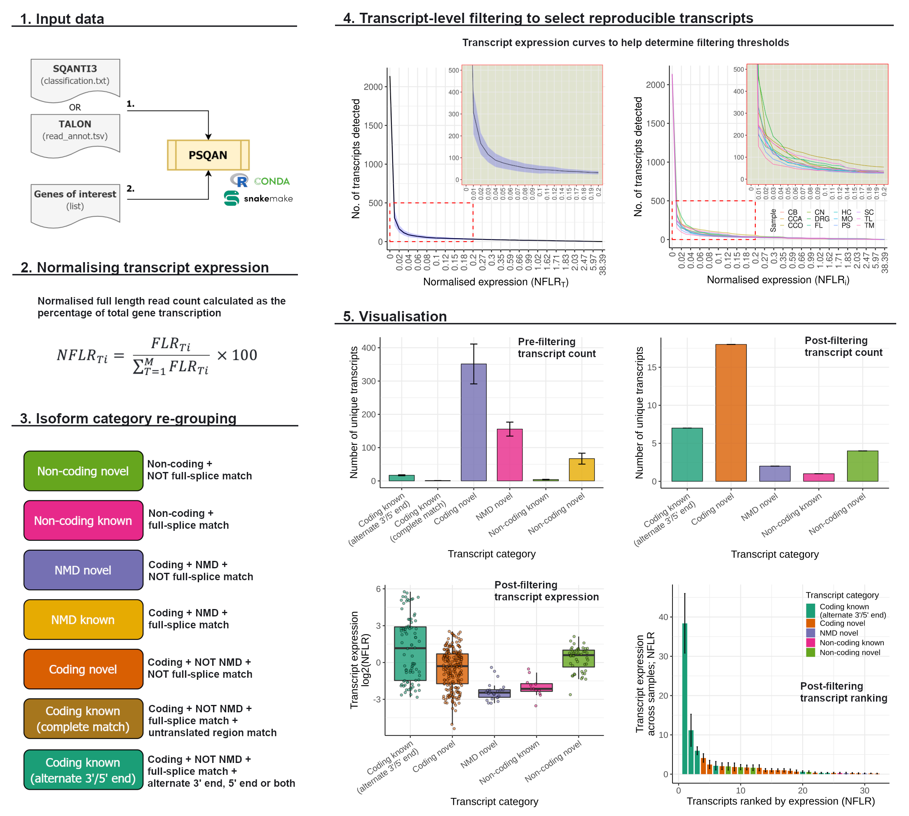
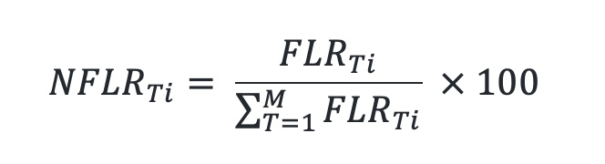
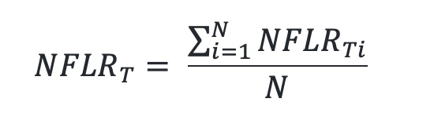
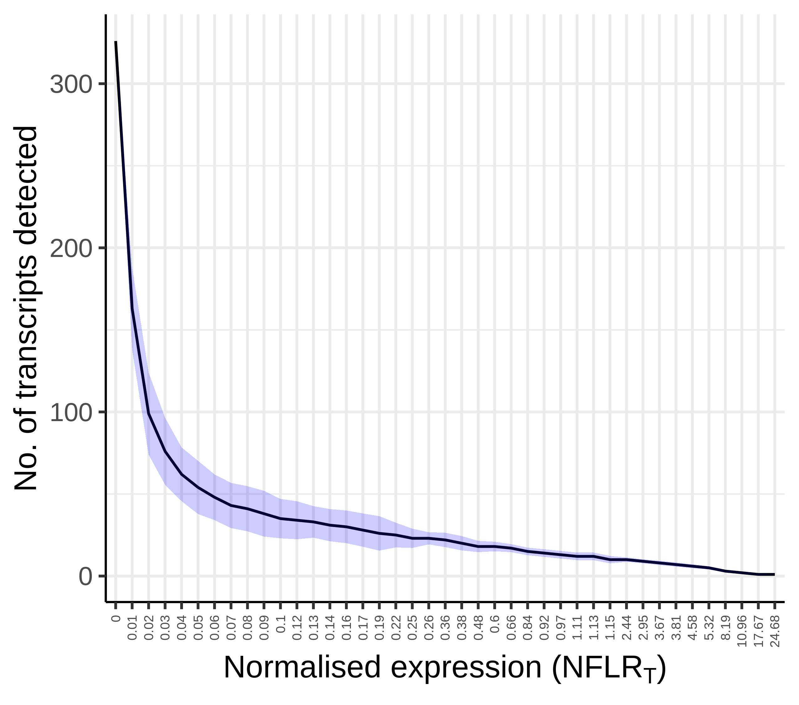
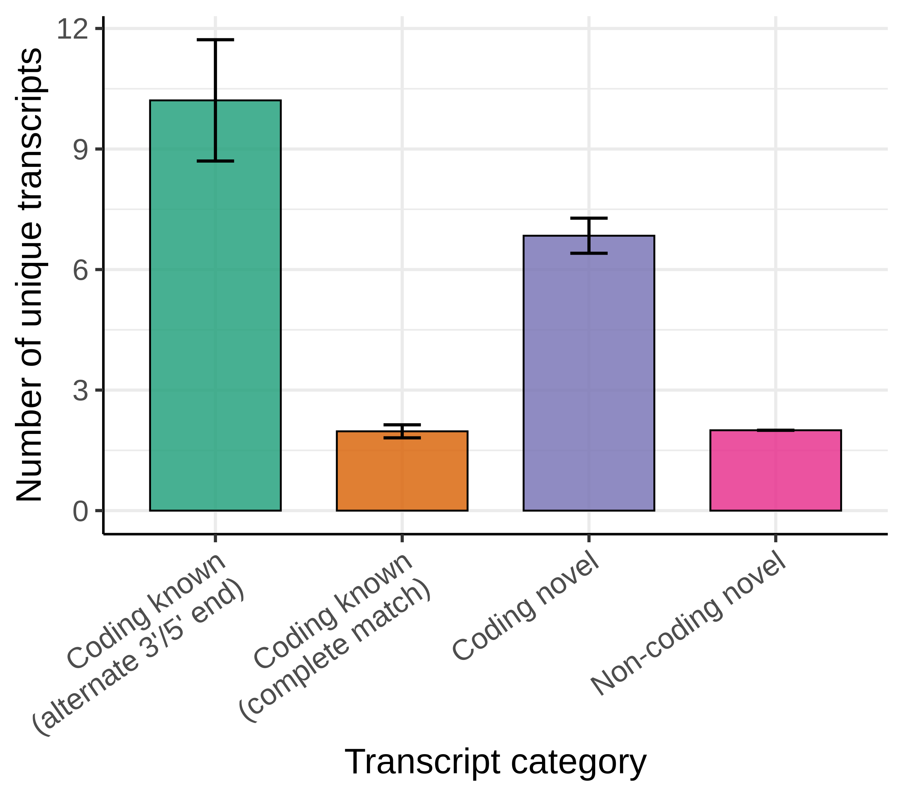
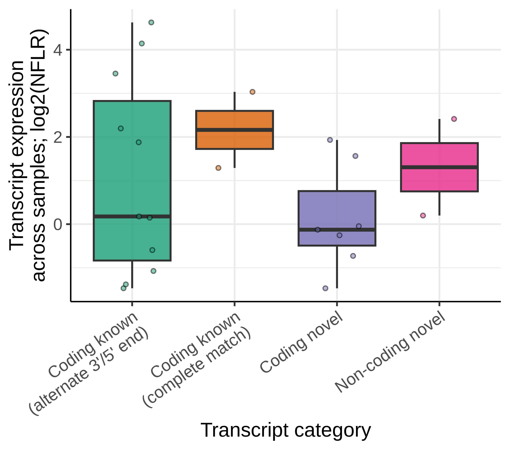
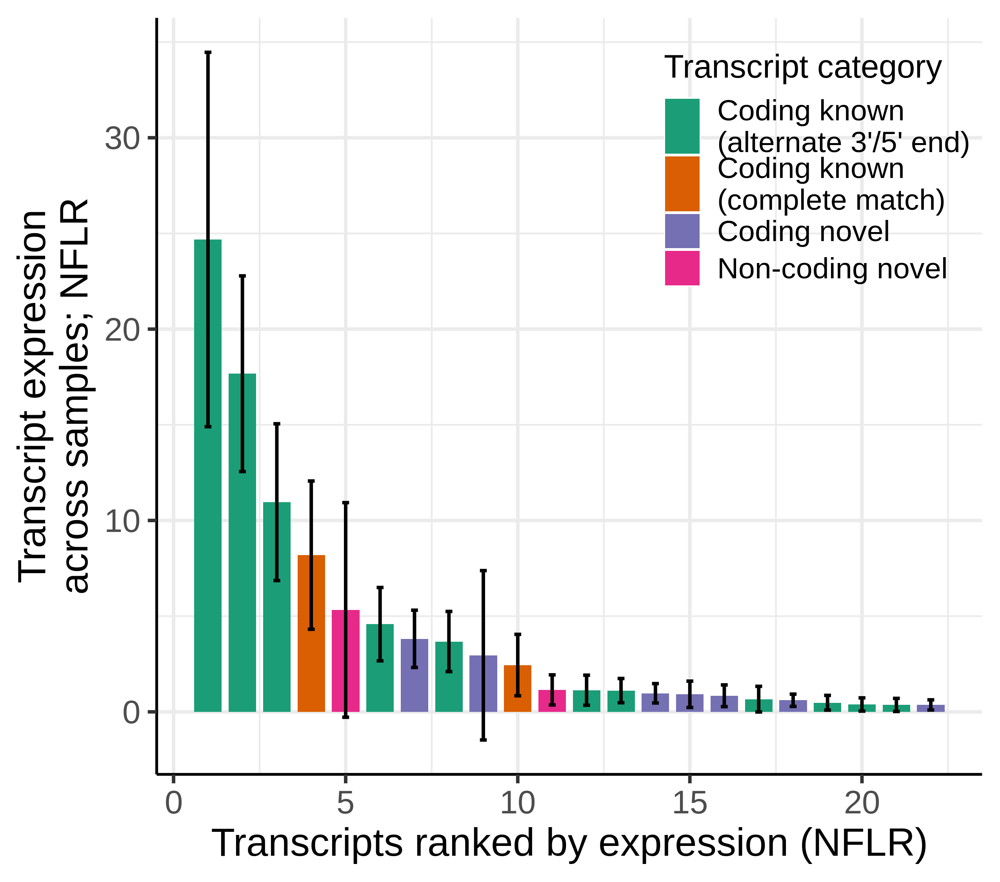

# PSQAN - a pipeline to prioritise novel and biologically relevant transcripts from long-read RNA sequencing

<!-- badges: start -->
[](https://snakemake.github.io)
[](https://github.com/sid-sethi/PSQAN/blob/main/LICENSE)
[](https://github.com/sid-sethi/PSQAN/actions/workflows/main.yml)
<!-- badges: end --->

## Table of contents
- [Overview](#overview)
- [Introduction](#introduction)
- [Description](#description)
  - [Input data](#input-data)
  - [Normalising transcript expression per gene](#normalising-transcript-expression-per-gene)
  - [Isoform categorisation](#isoform-categorisation)
  - [Filtering isoforms](#filtering-isoforms)
- [Getting Started](#getting-started)
  - [Dependencies](#dependencies)
  - [Installation](#installation)
  - [Input](#input)
  - [Practical Suggestions](#practical-suggestions)
  - [Usage](#usage)
  - [Output](#output)
    - [Directory structure](#directory-structure)
    - [Visualisations](#visualisations)
      - [Transcript detected vs. expression](#transcript-detected-vs-expression)
      - [Transcript count](#transcript-count)
      - [Transcript expression](#transcript-expression)
      - [Ranked transcripts](#ranked-transcripts)
- [Other useful commands](#other-useful-commands)
- [Licence](#licence)

## Overview
  

## Introduction
Despite the advances in tools to process long-read RNA-sequencing (lrRNA-seq) data, the downstream analysis of transcriptional data remains challenging due to the detection of thousands of novel transcripts and the lack of tools to prioritise functionally important transcripts. From such a large number of transcripts, it is difficult to distinguish between stable transcripts of potential biological importance, partially processed RNAs and splicing noise. Furthermore, when using lrRNA-seq to identify rare and novel transcripts, the recommendation is to incorporate multiple replicates in the study design and implement transcript-level filters. However, determining optimal expression thresholds for filtering and selecting transcripts which are reproducible across samples remains a significant challenge. Consequently, researchers find it challenging to interpret lrRNA-seq data effectively and generate relevant hypothesis which could be experimentally validated in the laboratory.

PSQAN (**P**ost-transcriptomic **S**tructural **Q**uality **A**ssessment and **N**ormalisation) is a Snakemake workflow designed to help researchers identify high-confidence transcripts associated with candidate genes. PSQAN performs a gene-based analysis on characterised transcripts generated by [SQANTI3](https://github.com/ConesaLab/SQANTI3 "SQANTI homepage") and [TALON](https://github.com/mortazavilab/TALON/tree/master "TALON homepage"). PSQAN normalises transcript expression per gene and re-groups transcripts into actionable categories to support transcript prioritisation, hence making the results more interpretable. PSQAN generates visualisations to help users determine optimal expression thresholds for detecting both known and novel transcripts of probable biological importance. Furthermore, PSQAN allows users to apply multiple transcript level expression thresholds, both to per sample and across all samples. Lastly, PSQAN generates visualisations and an HTML report, enabling users to explore the known and novel transcripts expressed by a gene, alongside their transcript categories and transcript expression. An example of the report generated by PSQAN for a single gene can be downloaded [here](example_output/report.html).

## Description
### Input data

PSQAN can be used with the transcript characterisation output of either SQANTI3 or TALON, which are the two most prominently used tools in long-read RNA-seq data analysis. PSQAN takes the output produced by SQANTI3 or TALON as input, along with a list of candidate genes to analyse. For each gene, PSQAN extracts the isoforms associated with the gene from the output generated by SQANTI3/TALON. Since the filtering steps in SQANTI3 and TALON are optional and may be skipped, PSQAN applies its own filtering criteria prior to processing to ensure the removal of potential genomic contamination and rare PCR artifacts. PSQAN removes isoforms with a high percentage of genomic "A"s in their downstream 20 bp window (80% is the default), or if one of its junctions is predicted to be a template switching artifact (tagged as "RTS_stage" by SQANTI3).

> **_Note:_** Output of TALON does not contain all the transcript-level descriptors required by PSQAN. As a result, certain PSQAN processes are skipped when using TALON output. The processes performed by PSQAN for SQANTI3 and TALON are summarised below:

PSQAN process | SQANTI3	| TALON
------------- | ------- | -------- 
Filtering internal priming artifacts | Yes | Yes
Filtering template switching artifacts	| Yes	| No (missing required data)
Normalising transcript expression	| Yes	| Yes
Isoform re-categorisation	| Yes	| No (missing required data)
Transcript-level filtering	| Yes	| Yes
Visualisations	| Yes	| Yes

### Normalising transcript expression per gene
PSQAN calculates the normalised full-length reads for each transcript (*NFLR*<sub>*Ti*</sub>), which quantifies transcript expression as the percentage of total gene transcription. This normalisation emphasises transcript usage relative to overall gene output, thereby simplifying interpretation. For instance, a transcript with an NFLR value of 10.0 would imply that it accounts for 10% towards all transcripts generated from the gene locus. PSQAN’s normalisation also removes variation due to overall gene expression differences between samples, hence making comparisons of transcript usage independent of absolute gene expression.

Given a transcript *T* in sample *i* with *FLR* as the number of full-length reads mapped to the transcript *T*, PSQAN calculates the normalised full-length reads (*NFLR*<sub>*Ti*</sub>) as:

<p align="center">
    
</p>

where, *NFLR*<sub>*Ti*</sub> represents the normalised full-length read count of transcript *T* in sample *i*, *FLR*<sub>*Ti*</sub> is the full-length read count of transcript *T* in sample *i* and *M* is the total number of transcripts identified to be associated with the gene after filtering. Finally, to summarise the expression of a transcript associated with a gene across multiple samples (if any), PSQAN calculates the mean of *NFLR*<sub>*Ti*</sub> across all the samples:

<p align="center">
    
</p>

where, *NFLR*<sub>*T*</sub> represents the mean expression of transcript *T* across all samples and *N* is the total number of samples.

> **_Note:_** PSQAN's normalisation approach has certain limitations that should be considered. First, because this metric does not account for sequencing depth, it may introduce bias if samples with very low coverage are analysed alongside high-coverage samples. Second, it may not be suitable on its own for differential expression analysis at either the gene or transcript level. Third, transcript usage derived from this metric cannot be compared across different genes, as each gene is normalised independently.

### Isoform category re-grouping
If PSQAN is used with the output of SQANTI3, it also performs isoform re-grouping into categories which are easy to interpret and facilitates prioritising potentially relevant transcripts. Using the open reading frame (ORF) prediction, nonsense-mediated decay (NMD) prediction and structural categorisation (based on the comparison with reference annotation) of SQANTI3, PSQAN groups the identified isoforms into the following seven categories:
  - Non-coding novel - if predicted to be non-coding and not a full-splice match with the reference
  - Non-coding known - if predicted to be non-coding and a full-splice match with the reference
  - NMD novel - if predicted to be coding and NMD, and not a full-splice match with the reference
  - NMD known - if predicted to be coding and NMD, and a full-splice match with the reference
  - Coding novel - if predicted to be coding and not NMD, and not a full-splice match with the reference
  - Coding known (complete match) - if predicted to be coding and not NMD, and a full-splice and untranslated region match with the reference
  - Coding known (alternate 3'/5' end) - if predicted to be coding and not NMD, and a full-splice match with the reference but with an alternate 3’ end, 5’ end or both 3’ and 5’ end.

### Transcript-level filtering
PSQAN implements filtering strategies which provides flexibile and data-driven refinement:
1. a minimum threshold on transcript expression per sample (*NFLR*<sub>*Ti*</sub>)
2. a minimum threshold on the mean expression across all samples (*NFLR*<sub>*T*</sub>) - not applicable if data has only one sample
3. a minimum percentage of samples in which a transcript must meet the minimum per sample expression threshold - not applicable if data has only one sample

Furthermore PSQAN provides a visualisation of the [number of detected transcripts as a function of varying expression thresholds](#transcript-detected-vs-expression), showing the number of transcripts which will be retained at every *NFLR*<sub>*T*</sub> threshold. This plot enables users to visually inspect and determine an appropriate *NFLR*<sub>*T*</sub> threshold for retaining high-confidence transcripts. In datasets with multiple samples, PSQAN generates a *NFLR*<sub>*Ti*</sub> curve per sample, allowing researchers to examine the variability in transcript detection across samples. This visualisation supports informed decision-making regarding: (a) the minimum expression value at which a transcript should be expressed within each sample; and (b) the minimum number of samples in which a transcript must meet the minimum expression threshold to be considered reproducible.

## Getting Started

### Dependencies

- Conda, Miniconda or Mamba (preferred)
- The rest of the dependencies (including snakemake) are installed via conda using the `environment.yml` file

### Installation

Clone the directory:
```bash
git clone --recursive https://github.com/sid-sethi/PSQAN.git
```

Create conda environment for the pipeline which will install all the dependencies:
```bash
cd PSQAN
conda env create -f environment.yml --prefix psqan_venv
```

### Input

- SQANTI output (classification.txt) or TALON output (read_annot.tsv)
- A file containing Gene IDs of genes of interest to analyse

[Example](tests/test_data/sqanti_genes.txt) of gene id file:
```
gene_id
GeneID1
GeneID2
GeneID3
```

### Practical Suggestions
- Please see the note on PSQAN limitations under the [normalisation section](#normalising-transcript-expression-per-gene). We recommend using PSQAN on samples with comparable sequencing depth.
- PSQAN can first be run using the default filtering thresholds to generate pre-filtering visualisations. After examining these visualisations, users can determine suitable thresholds and rerun PSQAN with the updated parameters.

### Usage

Modify [config.yml](config/config.yml) to configure this workflow according to your dataset and parameters.

Parameter | Description
------ | -----------
workdir [STRING] | [**REQUIRED**] Path of working/project directory. This directory should exist. All PSQAN results would be saved within this directory
abundance [FILE] | [**REQUIRED**] Transcript abundance file. Abundance output file from `SQANTI` and `TALON` are accepted by PSQAN. For SQANTI, the file ending with "classification.txt" should be provided, while for TALON, read annotation file ending with "read_annot.tsv" should be used
abundance_type [STRING] | File type of transcript abundance input file. Accepted choices: ["SQANTI", "TALON"]; [default = "SQANTI"]
gene_ids [FILE] | [**REQUIRED**] A file containing Gene IDs of genes of interest to run PSQAN. Gene IDs column name should be **`gene_id`**. If the file contains more than one column, it should be a tab-seperated file - other columns in the file will be ignored
percentage_A_downstream_TTS [NUMERIC] [0-100] | Maximum percent of genomic "A"s allowed in the immediate downstream window of the read/isoform. This helps to filter out internal priming artifacts. If percent of genomic "A"s is high (say > 80), the 3' end site of the isoform is probably not reliable. If using `TALON` abundance file, this percentage is divided by 100 to convert into a fraction. [default = 80]
multisample [BOOLEAN] | Do you have transcript abundance of more than one sample/replicate in abundance file? [default = false]
min_exp_perSample [NUMERIC] [0-100] | Minimum value of normalised expression required for a transcript **PER** sample (or replicate). If $multisample=false$, transcripts with normalised expression $>=$ min_exp_perSample would be retained. If $multisample=true$, this parameter is combined with `min_sample_perc` and transcripts which pass the `min_exp_perSample` threshold in at least `min_sample_perc` % of samples are retained. [default = 0.3]
min_exp_mean [NUMERIC] [0-100] | Minimum value of mean normalised expression **ACROSS** all samples required for a transcript. If $multisample=false$, this parameter is ignored. [default = 0]
min_sample_perc [NUMERIC] [0-100] | Minimum % of samples which should pass the `min_exp_perSample` threshold. For instance, min_sample_perc=30 and min_exp_perSample=10 would mean that transcripts identified with a minimum normalised expression of 10 in at least 30% of the total samples would be retained. If $multisample=false$, this parameter is ignored. [default = 0]

> **_TIP:_** Run PSQAN with default values and use the [NFLR_curve plots](example_output/ENSG00000TEST/NFLR_curve_main.png) to identify optimal values of `min_exp_perSample`, `min_exp_mean` and `min_sample_perc` for your dataset.

To run the workflow, use the following commands from the root directory:
```bash
conda activate psqan_env
snakemake -j <num_cores> all
```
The number of cores control how many genes are analysed in parallel. After the snakemake process runs successfully, you can build a html report
```bash
snakemake --report <report_name>.html
```
You may also use the `Makefile` to run PSQAN instead of `snakemake` commands. Note that conda environment is automatically activated in the make commands.
```bash
make run_psqan    # runs with -j=10 parameter, i.e. 10 cores
make run_report
```

### Output

An example of the workflow output can be viewed [here](./example_output).

#### Directory structure
```
working directory  
|--- config.yml                # copy of the parameters used in the pipeline  
|--- report.html               # if snakemake report is generated at the end of the run
|--- Gene_A/  
     |--- pre-filtering/       # plots generated before performing filtering  
     |--- post-filtering/transcriptsRanked.txt      # plots generated after performing filtering   
     |--- logs/              
     |--- gene_normalised_abundance.txt              
     |--- filtered_transcripts.txt              
     |--- NFLR_curve.png              
     |--- NFLR_curve_values.txt          
|--- Gene_B/  
|--- Gene_C/  
```
#### Visualisations
PSQAN generates multiple visualisations to aid in the interpretation of results. In addition to visualising [transcripts across varying expression thresholds](#transcript-detected-vs-expression), PSQAN plots the [number of transcripts detected in each isoform category](#transcript-count) and their [normalised expression](#transcript-expression), both before and after filtering. For datasets with multiple samples, PSQAN also computes variability across the samples as standard deviation, which is displayed as error bars. PSQAN displays all transcripts associated with a gene [ranked by their normalised expression](#ranked-transcripts) and coloured by transcript category, allowing users to easily identify dominant transcripts of a gene. Lastly, PSQAN provides an option to generate a gene-level [HTML report](example_output/report.html), compiling all visualisations to facilitate result interpretation.

##### Transcript detected vs. expression
Number of transcripts detected as a function of varying expression thresholds. This plot can be used to determine the minimum expression threshold to identify high-confidence transcripts.
<p align="center">
  
</p>


##### Transcript count
Number of transcripts detected grouped by transcript categories.
<p align="center">
   
</p>

##### Transcript expression
Expression of transcripts in each transcript category.
<p align="center">
  
</p>

##### Ranked transcripts
Transcripts ranked according to their normalised expression and coloured based on transcript category.
<p align="center">
  
</p>

## Other useful commands

You can do a dry run (using -n parameter) to view what would be done by the pipeline before executing the pipeline.

```bash
snakemake -n all
```

To exit a running `snakemake` pipeline, hit `ctrl+c` on the terminal. If the pipeline is running in the background, you can send a `TERM` signal which will stop the scheduling of new jobs and wait for all running jobs to be finished.

```bash
killall -TERM snakemake
```

To deactivate the conda environment:
```bash
conda deactivate
```

## Licence
<p align="left">
    
</p>

Copyright 2024 Astex Therapeutics Ltd.

This repository is free software: you can redistribute it and/or modify it under the terms of the GNU General Public License as published by the Free Software Foundation, either version 3 of the License, or (at your option) any later version.

This repository is distributed in the hope that it will be useful, but WITHOUT ANY WARRANTY; without even the implied warranty of MERCHANTABILITY or FITNESS FOR A PARTICULAR PURPOSE. See the [LICENSE](LICENSE) file (GNU General Public License) for more details.