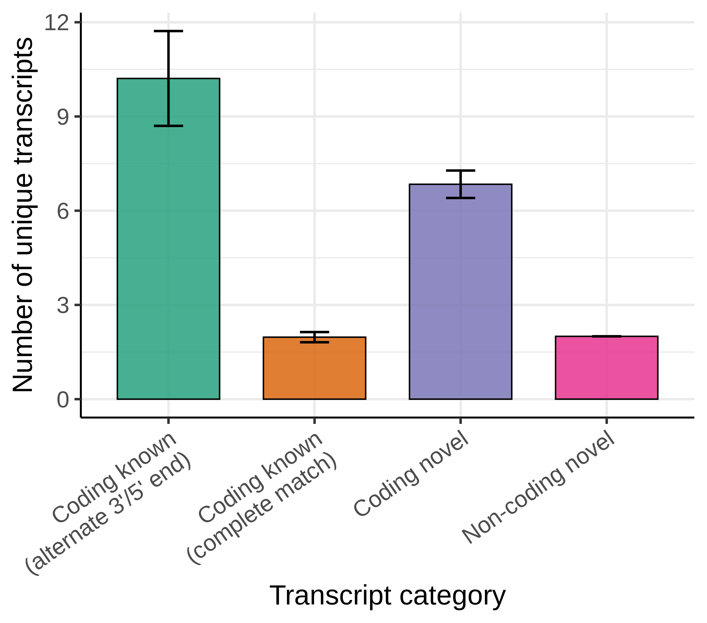

# PSQAN - Post Sqanti QC ANalysis of long-read RNA sequencing

<!-- badges: start -->
[](https://snakemake.github.io)
[](https://github.com/sid-sethi/PSQAN/blob/main/LICENSE)
<!-- badges: end -->


## Table of contents
- [Introduction](#introduction)
  - [Removing internal priming artefacts](#removing-internal-priming-artefacts)
  - [Normalising transcript expression per gene](#normalising-transcript-expression-per-gene)
  - [Isoform categorisation](#isoform-categorisation)
  - [Filtering isoforms](#filtering-isoforms)
- [Getting Started](#getting-started)
  - [Dependencies](#dependencies)
  - [Installation](#installation)
  - [Input](#input)
  - [Usage](#usage)
  - [Output](#output)
      - [Directory structure](#directory-structure)
      - [Transcript detected vs. expression](#transcript-detected-vs-expression)
      - [Transcript count](#transcript-count)
      - [Transcript expression](#transcript-expression)
      - [Ranked transcripts](#ranked-transcripts)
  - [Other useful commands](#other-useful-commands)
  - [Licence](#licence)


## Introduction
PSQAN is a Snakemake workflow for performing QC analysis on long-read sequencing data post transcript characterisation by [SQANTI](https://github.com/ConesaLab/SQANTI3 "SQANTI homepage") or [TALON](https://github.com/mortazavilab/TALON/tree/master "TALON homepage"). Current long-read platforms are prone to errors, which makes the downstream analysis of such data very challenging. A typical analysis workflow coupled with SQANTI or TALON, results in a large number of novel transcripts. It is important to select only the novel transcript models which are reproducible across the samples with a minimum expression value. However, it is difficult to identify optimal expression thresholds to remove artefacts. PSQAN aims to help in the process of identifying high-confidence novel transcripts associated with a gene. PSQAN performs **gene-based analysis** which can be used to explore the novel transcript categories and transcript expression associated with a gene. PSQAN filters transcripts which could be possible artifacts, normalises transcript expression and generates multiple visualisations which can help in determining optimal expression thresholds to identify genuine transcripts (for both known and novel). An example of the report generated by PSQAN for a single gene can be viewed [here](example_output/report.html).

### Removing internal priming artefacts

Following transcript characterisation from SQANTI or TALON, PSQAN applies a set of filtering criteria to remove potential genomic contamination and rare PCR artifacts. PSQAN removes isoforms with high percent of genomic "A"s in the downstream 20 bp window and if one of its junctions is predicted to be template switching artifact (tagged as "RTS_stage" = TRUE in SQANTI output). 

### Normalising transcript expression per gene

Given a transcript *T* in sample *i* with *FLR* as the number of full-length reads mapped to the transcript *T*, PSQAN calculates the normalised full-length reads (*NFLR*<sub>*Ti*</sub>) as the **percentage of total gene transcription in the sample**:

<p align="center">
    
</p>

where, *NFLR*<sub>*Ti*</sub> represents the normalised full-length read count of transcript *T* in sample *i*, *FLR*<sub>*Ti*</sub> is the full-length read count of transcript *T* in sample *i* and *M* is the total number of transcripts identified to be associated with the gene after filtering. Finally, to summarise the expression of a transcript associated with a gene in case where multiple samples, PSQAN calculates the mean of normalised full-length reads (*NFLR*<sub>*Ti*</sub>) across all the samples:

<p align="center">
    
</p>

where, *NFLR*<sub>*T*</sub> represents the mean expression of transcript *T* across all samples and *N* is the total number of samples.

> **_Example:_** For instance, a transcript with a *NFLR* value of *10.0* would mean that it contributes *10%* towards the total transcription of the gene.

### Isoform categorisation
For SQANTI output, PSQAN also performs isoform re-categorisation using SQANTI’s output of ORF prediction, NMD prediction and structural categorisation based on comparison with the reference annotation. PSQAN groups the identified isoforms into the following categories:
  - Non-coding novel - if predicted to be non-coding and not a full-splice match with the reference
  - Non-coding known - if predicted to be non-coding and a full-splice match with the reference
  - NMD novel - if predicted to be coding & NMD, and not a full-splice match with the reference
  - NMD known - if predicted to be coding & NMD, and a full-splice match with the reference
  - Coding novel - if predicted to be coding & not NMD, and not a full-splice match with the reference
  - Coding known (complete match) - if predicted to be coding & not NMD, and a full-splice & UTR match with the reference
  - Coding known (alternate 3'/5' end) - if predicted to be coding & not NMD, and a full-splice match with the reference but with an alternate 3’ end, 5’ end or both 3’ and 5’ end.

### Filtering isoforms

PSQAN can be first run with default filtering thresholds in order to generate pre-filtering visualisations. After exploring the pre-filtering visualisations, appropriate thresholds can be determined and PSQAN can be run again with the determined thresholds. PSQAN allows filtering of transcripts based on the following three values:
- Minimum value of normalised expression required for a transcript **PER** sample (or replicate)
- Minimum value of mean normalised expression **ACROSS** all samples required for a transcript (not applicable if data has only one sample)
- Minimum % of samples which should pass the minimum per sample threshold (not applicable if data has only one sample)  
  

## Getting Started

### Dependencies

- Conda, Miniconda or Mamba (preferred)
- The rest of the dependencies (including snakemake) are installed via conda using the `environment.yml` file

### Installation

Clone the directory:
```bash
git clone --recursive https://github.com/sid-sethi/PSQAN.git
```

Create conda environment for the pipeline which will install all the dependencies:
```bash
cd PSQAN
conda env create -f environment.yml --prefix psqan_venv
```

### Input

- SQANTI output (classification.txt) or TALON output (read_annot.tsv)
- A file containing Gene IDs of genes of interest to analyse

Example of gene id file:
```
gene_id
GeneID1
GeneID2
GeneID3
```


### Usage

Modify [config.yml](config/config.yml) to configure this workflow according to your dataset and parameters.

Parameter | Description
------ | -----------
workdir [STRING] | [**REQUIRED**] Path of working/project directory. This directory should exist. All PSQAN results would be saved within this directory
abundance [FILE] | [**REQUIRED**] Transcript abundance file. Abundance output file from `SQANTI` and `TALON` are accepted by PSQAN. For SQANTI, the file ending with "classification.txt" should be provided, while for TALON, read annotation file ending with "read_annot.tsv" should be used
abundance_type [STRING] | File type of transcript abundance input file. Accepted choices: ["SQANTI", "TALON"]; [default = "SQANTI"]
gene_ids [FILE] | [**REQUIRED**] A file containing Gene IDs of genes of interest to run PSQAN. Gene IDs column name should be **`gene_id`**. If the file contains more than one column, it should be a tab-seperated file - other columns in the file will be ignored
percentage_A_downstream_TTS [NUMERIC] [0-100] | Maximum percent of genomic "A"s allowed in the immediate downstream window of the read/isoform. This helps to filter out internal priming artifacts. If percent of genomic "A"s is high (say > 80), the 3' end site of the isoform is probably not reliable. If using `TALON` abundance file, this percentage is divided by 100 to convert into a fraction. [default = 80]
multisample [BOOLEAN] | Do you have transcript abundance of more than one sample/replicate in abundance file? [default = false]
min_exp_perSample [NUMERIC] [0-100] | Minimum value of normalised expression required for a transcript **PER** sample (or replicate). If $multisample=false$, transcripts with normalised expression $>=$ min_exp_perSample would be retained. If $multisample=true$, this parameter is combined with `min_sample_perc` and transcripts which pass the `min_exp_perSample` threshold in at least `min_sample_perc` % of samples are retained. [default = 0.3]
min_exp_mean [NUMERIC] [0-100] | Minimum value of mean normalised expression **ACROSS** all samples required for a transcript. If $multisample=false$, this parameter is ignored. [default = 0]
min_sample_perc [NUMERIC] [0-100] | Minimum % of samples which should pass the `min_exp_perSample` threshold. For instance, min_sample_perc=30 and min_exp_perSample=10 would mean that transcripts identified with a minimum normalised expression of 10 in at least 30% of the total samples would be retained. If $multisample=false$, this parameter is ignored. [default = 0]

> **_TIP:_** Run PSQAN with default values and use the [NFLR_curve plots](example_output/ENSG00000TEST/NFLR_curve_main.png) to identify optimal values of `min_exp_perSample`, `min_exp_mean` and `min_sample_perc` for your dataset.

To run the workflow, use the following commands from the root directory:
```bash
conda activate psqan_env
snakemake -j <num_cores> all
```
The number of cores control how many genes are analysed in parallel. After the snakemake process runs successfully, you can build a html report
```bash
snakemake --report <report_name>.html
```
You may also use the `Makefile` to run PSQAN instead of `snakemake` commands. Note that conda environment is automatically activated in the make commands.
```bash
make run_psqan    # runs with -j=10 parameter, i.e. 10 cores
make run_report
```

### Output

An example of the workflow output can be viewed [here](./example_output).

#### Directory structure
```
working directory  
|--- config.yml                # copy of the parameters used in the pipeline  
|--- report.html               # if snakemake report is generated at the end of the run
|--- Gene_A/  
     |--- pre-filtering/       # plots generated before performing filtering  
     |--- post-filtering/      # plots generated after performing filtering   
     |--- logs/              
     |--- gene_normalised_abundance.txt              
     |--- filtered_transcripts.txt              
     |--- NFLR_curve.png              
     |--- NFLR_curve_values.txt          
|--- Gene_B/  
|--- Gene_C/  
```

#### Transcript detected vs. expression

Number of transcripts detected as a function of varying expression thresholds. This plot can be used to determine the minimum expression threshold to identify high-confidence transcripts.
<p align="center">
  
</p>


#### Transcript count
Number of transcripts detected grouped by transcript categories.
<p align="center">
   
</p>

#### Transcript expression
Expression of transcripts in each transcript category.
<p align="center">
  
</p>

#### Ranked transcripts
Transcripts ranked according to their normalised expression and coloured based on transcript category.
<p align="center">
  
</p>

## Other useful commands

You can do a dry run (using -n parameter) to view what would be done by the pipeline before executing the pipeline.

```bash
snakemake -n all
```

To exit a running `snakemake` pipeline, hit `ctrl+c` on the terminal. If the pipeline is running in the background, you can send a `TERM` signal which will stop the scheduling of new jobs and wait for all running jobs to be finished.

```bash
killall -TERM snakemake
```

To deactivate the conda environment:
```bash
conda deactivate
```

## Licence
Copyright 2024 Astex Therapeutics Ltd.

This repository is free software: you can redistribute it and/or modify it under the terms of the GNU General Public License as published by the Free Software Foundation, either version 3 of the License, or (at your option) any later version.

This repository is distributed in the hope that it will be useful, but WITHOUT ANY WARRANTY; without even the implied warranty of MERCHANTABILITY or FITNESS FOR A PARTICULAR PURPOSE. See the [LICENSE](LICENSE) file (GNU General Public License) for more details.